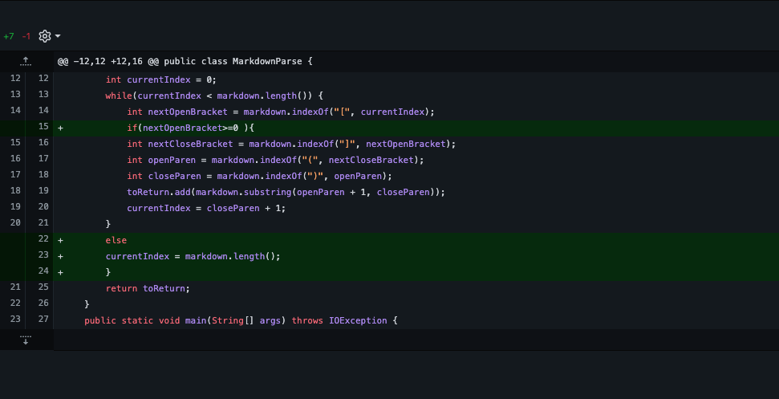
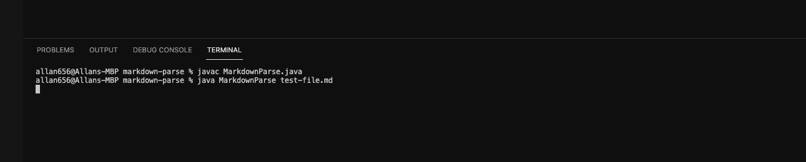
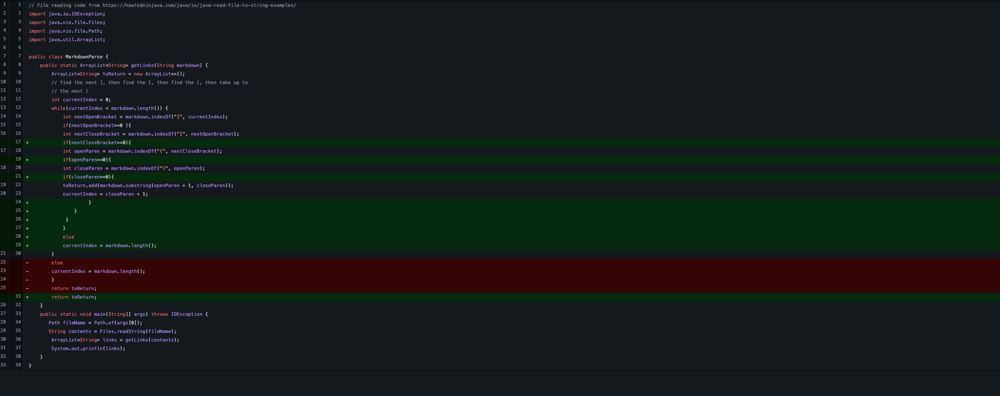
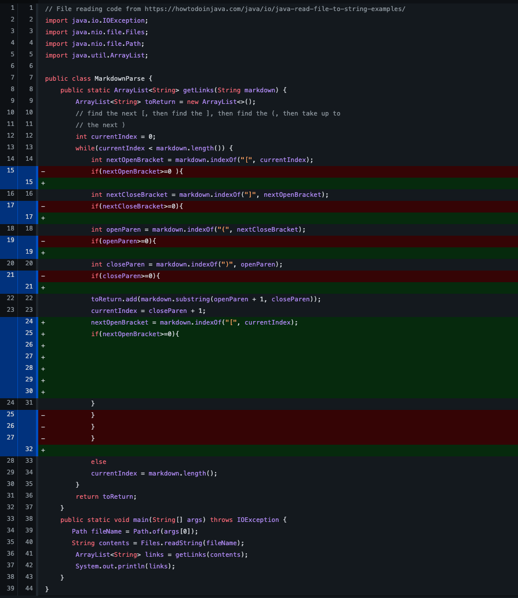
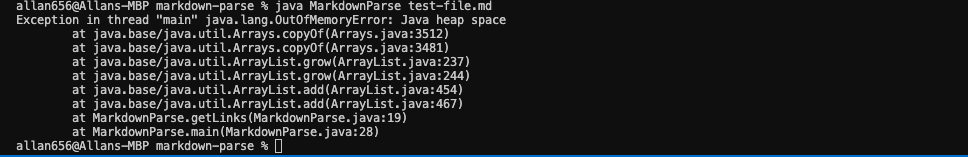

# Lab Report 2

**Code Change #1**

[link to error-inducing file](https://github.com/ad656/markdown-parse/blob/4877029f6d246b7a6e3143fe32ebb2ea7f5dc577/test-file.md)

Since the while look in MarkdownParse always checks for an open bracket before a link, the loop will infintely 
loop if the line of code does not contain brackets. To avoid this issue, we add a condition to only run the rest
of the loop if there is an open bracket found. 

**Code Change #2**

[link to error-inducing file](https://github.com/ad656/markdown-parse/blob/ac4a6f042e6f4711281599e566b50186158220bb/test-file.md)

This error covered any of the rest errors with missing paranthesis or brackets. In the absence of any of the four initially required symbols, 
the loop will go on forever but with the four if statements in place we are able to check for the lack of the symbols. 

**Code Change #3**

[link to error-inducing file](https://github.com/ad656/markdown-parse/blob/b5f644e27fc0f11f06b8dc8727d477964f3d6fd7/test-file.md)

When extra characters are added at the end of the close paranthesis of the last link, the loop runs infinitely and eventually there is 
an OutofMemory error. In order to fix this, we place an if statement that checks if there are any more open brackets after the last 
link. 